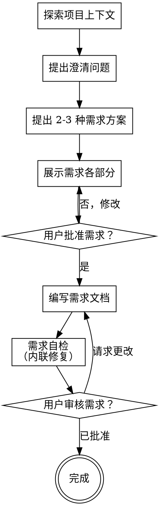

# 将想法转化为需求文档

通过自然的协作对话，帮助将想法转化为完整的需求文档和规格说明。

首先了解当前项目的上下文，然后使用 `AskUserQuestion` 工具逐一向用户提问以完善想法。一旦理解了需要构建的内容，展示需求方案并获得用户批准。

<HARD-GATE>
在展示需求方案并获得用户批准之前，不要调用任何实施技能、编写代码、搭建项目或采取任何实施行动。这适用于每一个项目，无论其看起来多么简单。
</HARD-GATE>

## 反模式："这个太简单了，不需要需求文档"

每个项目都要经历这个过程。待办事项列表、单一功能工具、配置更改——所有这些都需要。"简单"的项目正是那些因未经审视的假设而导致最多浪费工作的地方。需求文档可以很简短（真正简单的项目几句话即可），但你必须展示需求并获得批准。

## 检查清单

你必须为以下每个项目创建任务并按顺序完成：

1. **探索项目上下文** —— 检查文件、文档、最近的提交
2. **提出澄清问题** —— 使用 `AskUserQuestion` 工具，一次一个，理解目的/约束/成功标准
3. **提出 2-3 种需求方案** —— 附带权衡分析和你推荐的方案
4. **展示需求** —— 根据复杂程度分部分展示，每部分后获得用户批准
5. **编写需求文档** —— 保存到 `.cospec/draft/YYYY-MM-DD-<topic>-draft.md` 并提交
6. **需求自检** —— 快速内联检查占位符、矛盾、歧义、范围（见下文）
7. **用户审核书面需求** —— 请用户在继续前审核需求文件
8. **完成** —— 需求文档已就绪，可进入后续阶段

## 流程图

**最终状态是需求文档完成。** 需求文档获批后，可进入设计或实施阶段。

## 流程说明

**理解想法：**

- 首先检查当前项目状态（文件、文档、最近的提交）
- 在询问详细问题之前，评估范围：如果请求描述了多个独立的子系统（例如，"构建一个包含聊天、文件存储、计费和分析的平台"），立即标记出来。不要在一个需要分解的项目上花费时间完善细节。
- 如果项目太大无法放入单个需求文档，帮助用户将其分解为子项目：有哪些独立的部分、它们如何关联、应该按什么顺序构建？然后通过正常的需求流程对第一个子项目进行头脑风暴。每个子项目都有自己的需求 → 设计 → 实施周期。
- 对于适当规模的项目，使用 `AskUserQuestion` 工具逐一向用户提问以完善想法
- 尽可能使用 `AskUserQuestion` 工具的多项选择模式，但开放式问题也可以
- 每次调用 `AskUserQuestion` 只问一个问题——如果一个话题需要更多探索，将其分解为多次调用
- 重点关注理解：目的、约束、成功标准、用户场景

**探索方案：**

- 提出 2-3 种不同的需求方案并分析其权衡
- 以对话方式展示选项，给出你的推荐和理由
- 首先展示你推荐的选项并解释原因

**展示需求：**

- 一旦你理解了要构建的内容，展示需求方案
- 根据复杂程度调整每个部分的长度：简单明了的用几句话，复杂的用 200-300 字
- 每部分后使用 `AskUserQuestion` 工具询问到目前为止是否正确
- 涵盖：用户故事、功能需求、非功能需求、验收标准、范围边界
- 如果某些内容不合理，准备好返回并澄清

**为清晰性和可验证性编写需求：**

- 每个需求应该是可验证的——你能明确判断它是否被满足吗？
- 使用用户故事格式："作为[角色]，我希望[功能]，以便[价值]"
- 明确验收标准：给定/当/则（Given/When/Then）格式
- 区分"必须拥有"和"锦上添花"——无情地 YAGNI
- 有人能在不猜测的情况下理解这个需求吗？测试人员能为其编写测试用例吗？如果不能，需求需要更清晰。

**在现有代码库中工作：**

- 在提出需求之前，探索当前的功能和约束
- 如果现有系统有影响新需求的行为（例如，现有用户流程、数据约束），将这些作为需求上下文的一部分
- 不要提出不相关的改动。专注于为当前目标服务的内容。

## 需求文档完成后

**文档：**

- 将经过验证的需求写入 `.cospec/draft/YYYY-MM-DD-<topic>-draft.md`
- 如果可用，使用 elements-of-style:writing-clearly-and-concisely 技能
- 将需求文档提交到 git

**需求自检：**
编写需求文档后，用新的眼光审视它：

1. **占位符扫描：** 是否有 "TBD"、"TODO"、不完整的部分或模糊的需求？修复它们。
2. **内部一致性：** 各部分之间是否有矛盾？用户故事是否与功能需求匹配？
3. **范围检查：** 这是否足够聚焦用于单个迭代，还是需要分解？
4. **歧义检查：** 任何需求是否可能被以两种方式理解？如果是，选择一种并明确说明。
5. **可验证性检查：** 每个需求是否有明确的验收标准？能否客观判断是否完成？

内联修复任何问题。不需要重新审核——只需修复并继续。

**用户审核关卡：**
需求审核循环通过后，请用户在继续前审核书面需求：

> "需求文档已编写并提交到 `<path>`。请在继续前审核它，并告诉我是否需要做任何更改。"

等待用户回应。如果他们请求更改，进行修改并重新运行需求审核循环。只有用户批准后才能继续。

**后续步骤：**

- 需求文档获批后，可进入设计阶段（如需要）或直接进入实施阶段
- 如需创建设计文档，可调用相关设计技能
- 如需创建实施计划，可调用 writing-plans 技能

## 核心原则

- **一次一个问题** —— 使用 `AskUserQuestion` 工具，每次只问一个问题，不要用多个问题压倒用户
- **优先使用多项选择** —— 使用 `AskUserQuestion` 工具的多项选择模式，尽可能比开放式问题更容易回答
- **无情地 YAGNI** —— 从所有需求中删除不必要的功能
- **探索替代方案** —— 在确定之前总是提出 2-3 种方案
- **增量验证** —— 展示需求，在继续前获得批准
- **保持灵活** —— 当某些内容不合理时，返回并澄清
