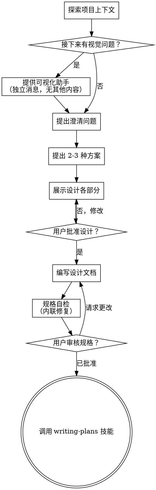

# 将想法转化为设计

通过自然的协作对话，帮助将想法转化为完整的设计和规格说明。

首先了解当前项目的上下文，然后逐一向用户提问以完善想法。一旦理解了需要构建的内容，展示设计方案并获得用户批准。

<HARD-GATE>
在展示设计方案并获得用户批准之前，不要调用任何实施技能、编写代码、搭建项目或采取任何实施行动。这适用于每一个项目，无论其看起来多么简单。
</HARD-GATE>

## 反模式："这个太简单了，不需要设计"

每个项目都要经历这个过程。待办事项列表、单一功能工具、配置更改——所有这些都需要。"简单"的项目正是那些因未经审视的假设而导致最多浪费工作的地方。设计可以很简短（真正简单的项目几句话即可），但你必须展示设计并获得批准。

## 检查清单

你必须为以下每个项目创建任务并按顺序完成：

1. **探索项目上下文** —— 检查文件、文档、最近的提交
2. **提供可视化助手**（如果话题涉及视觉问题）—— 这是一条独立的消息，不与澄清问题合并。参见下面的可视化助手部分。
3. **提出澄清问题** —— 一次一个，理解目的/约束/成功标准
4. **提出 2-3 种方案** —— 附带权衡分析和你推荐的方案
5. **展示设计** —— 根据复杂程度分部分展示，每部分后获得用户批准
6. **编写设计文档** —— 保存到 `docs/superpowers/specs/YYYY-MM-DD-<topic>-design.md` 并提交
7. **规格自检** —— 快速内联检查占位符、矛盾、歧义、范围（见下文）
8. **用户审核书面规格** —— 请用户在继续前审核规格文件
9. **过渡到实施** —— 调用 writing-plans 技能创建实施计划

## 流程图

**最终状态是调用 writing-plans。** 不要调用 frontend-design、mcp-builder 或任何其他实施技能。brainstorming 之后唯一调用的技能是 writing-plans。

## 流程说明

**理解想法：**

- 首先检查当前项目状态（文件、文档、最近的提交）
- 在询问详细问题之前，评估范围：如果请求描述了多个独立的子系统（例如，"构建一个包含聊天、文件存储、计费和分析的平台"），立即标记出来。不要在一个需要分解的项目上花费时间完善细节。
- 如果项目太大无法放入单个规格说明，帮助用户将其分解为子项目：有哪些独立的部分、它们如何关联、应该按什么顺序构建？然后通过正常的设计流程对第一个子项目进行头脑风暴。每个子项目都有自己的规格 → 计划 → 实施周期。
- 对于适当规模的项目，逐一向用户提问以完善想法
- 尽可能使用多项选择题，但开放式问题也可以
- 每条消息只问一个问题——如果一个话题需要更多探索，将其分解为多个问题
- 重点关注理解：目的、约束、成功标准

**探索方案：**

- 提出 2-3 种不同的方案并分析其权衡
- 以对话方式展示选项，给出你的推荐和理由
- 首先展示你推荐的选项并解释原因

**展示设计：**

- 一旦你理解了要构建的内容，展示设计方案
- 根据复杂程度调整每个部分的长度：简单明了的用几句话，复杂的用 200-300 字
- 每部分后询问到目前为止是否正确
- 涵盖：架构、组件、数据流、错误处理、测试
- 如果某些内容不合理，准备好返回并澄清

**为隔离性和清晰性设计：**

- 将系统分解为较小的单元，每个单元有一个明确的目的，通过定义良好的接口通信，并且可以独立理解和测试
- 对于每个单元，你应该能够回答：它做什么、如何使用它、它依赖什么？
- 有人能在不阅读内部实现的情况下理解一个单元的功能吗？你能在不破坏消费者的情况下更改内部实现吗？如果不能，边界需要调整。
- 更小、边界清晰的单元也更容易处理——你能更好地理解一次就能掌握的代码，当文件聚焦时你的编辑也更可靠。当一个文件变得很大时，这通常是一个信号，表明它做得太多了。

**在现有代码库中工作：**

- 在提出更改之前，探索当前的结构。遵循现有模式。
- 如果现有代码有影响工作的问题（例如，文件太大、边界不清晰、职责纠缠），将这些有针对性的改进作为设计的一部分——就像优秀开发人员在工作的代码中改进代码一样。
- 不要提出不相关的重构。专注于为当前目标服务的内容。

## 设计完成后

**文档：**

- 将经过验证的设计（规格）写入 `docs/superpowers/specs/YYYY-MM-DD-<topic>-design.md`
  - （用户对规格位置的偏好优先于此默认值）
- 如果可用，使用 elements-of-style:writing-clearly-and-concisely 技能
- 将设计文档提交到 git

**规格自检：**
编写规格文档后，用新的眼光审视它：

1. **占位符扫描：** 是否有 "TBD"、"TODO"、不完整的部分或模糊的需求？修复它们。
2. **内部一致性：** 各部分之间是否有矛盾？架构是否与功能描述匹配？
3. **范围检查：** 这是否足够聚焦用于单个实施计划，还是需要分解？
4. **歧义检查：** 任何需求是否可能被以两种方式理解？如果是，选择一种并明确说明。

内联修复任何问题。不需要重新审核——只需修复并继续。

**用户审核关卡：**
规格审核循环通过后，请用户在继续前审核书面规格：

> "规格已编写并提交到 `<path>`。请在继续前审核它，并告诉我是否需要做任何更改。"

等待用户回应。如果他们请求更改，进行修改并重新运行规格审核循环。只有用户批准后才能继续。

**实施：**

- 调用 writing-plans 技能创建详细的实施计划
- 不要调用任何其他技能。下一步是 writing-plans。

## 核心原则

- **一次一个问题** —— 不要用多个问题压倒用户
- **优先使用多项选择** —— 尽可能比开放式问题更容易回答
- **无情地 YAGNI** —— 从所有设计中删除不必要的功能
- **探索替代方案** —— 在确定之前总是提出 2-3 种方案
- **增量验证** —— 展示设计，在继续前获得批准
- **保持灵活** —— 当某些内容不合理时，返回并澄清

## 可视化助手

一个基于浏览器的助手，用于在头脑风暴期间展示模型、图表和视觉选项。作为工具提供——不是模式。接受可视化助手意味着它可用于受益于视觉处理的问题；并不意味着每个问题都通过浏览器。

**提供可视化助手：** 当你预期即将到来的问题将涉及视觉内容（模型、布局、图表）时，一次性征求同意：
> "我们正在处理的一些内容，如果我能通过网页浏览器展示给你，可能会更容易解释。我可以在过程中组合模型、图表、对比和其他视觉内容。这个功能还比较新，可能会消耗较多 token。想试试吗？（需要打开本地 URL）"

**这个提议必须是独立的消息。** 不要将其与澄清问题、上下文摘要或任何其他内容合并。消息应该只包含上面的提议，没有其他内容。等待用户的回应后再继续。如果他们拒绝，则仅使用文本进行头脑风暴。

**每问题决策：** 即使用户接受了，也要为每个问题决定是使用浏览器还是终端。测试标准是：**用户通过看到会比阅读更好地理解这个吗？**

- **使用浏览器** 用于视觉内容——模型、线框图、布局对比、架构图、并排视觉设计
- **使用终端** 用于文本内容——需求问题、概念选择、权衡列表、A/B/C/D 文本选项、范围决策

关于 UI 话题的问题不一定是视觉问题。"在这个上下文中个性是什么意思？"是一个概念问题——使用终端。"哪种向导布局更好？"是一个视觉问题——使用浏览器。

如果他们同意使用可视化助手，在继续前阅读详细指南：
`skills/brainstorming/visual-companion.md`
